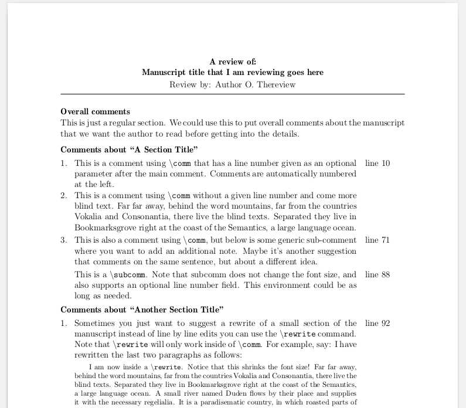

# Peer Review LaTeX package

`peer_review` is a LaTeX2e package that provides functionality for writing a review of a scientific manuscript.
The package provides clean formatting and convenient macros and environments for doing the review.


## Example output

Below is an example output from using `peer_review` in conjunction with the [`compact_proposal` class](https://github.com/ericbarefoot/compact_proposal).
This class provides a nice formatting and compaction of the standard `article` class, though `peer_review` can be used [on top of the base article class too](https://github.com/amoodie/peer_review/blob/master/private/article_example.png).




## Manual for using `peer_review`
See the [using `peer_review`](./using_peer_review.md) document.


## Installing


### Get the style file from GitHub

```
git clone https://github.com/amoodie/peer_review.git
```

or [download as a zip from GitHub](https://github.com/amoodie/peer_review/archive/master.zip).


### Symbolic links

This package can be added to your `tex`-tree by symbolic link. 
This has the benefit of allowing changes from the repository during development to be pulled directly down to the repository, keeping your version of the package up to date. 
Wherever you use the package from on your system, it will automatically call this version of the class file. 
This allows you to keep only one version of the file, and not be forced to place it in every folder you want to use the class with.

A proper symbolic link resides in your `tex`-tree and points to the local `git` repository. 
One example, with pseudocode is below. 

For a linux user with the default location of the `texlive` install, the following yields a proper symbolic link:

    sudo mkdir <local_path_to_textree>/tex/latex/peer_review
    sudo ln -s <local_path_above_this_repo>/peer_review/peer_review/peer_review.sty <local_path_to_textree>/tex/latex/peer_review/peer_review.sty

Note that the `tex`-tree is everything below `/usr/share/texlive/texmf-dist/`.

After the above command, a call to hash the `tex`-tree is necessary.

    sudo texhash


## Authors

* Andrew J. Moodie