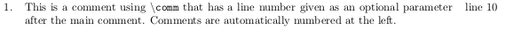
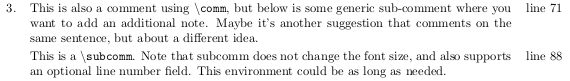
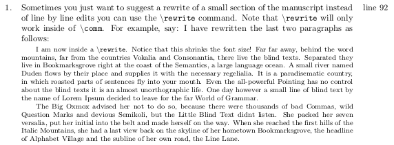

# Using `peer_review`

## Choosing a base class

The package can be used on top of any base class for your LaTeX document.
In the README, we show the result of using the [`compact_proposal` class](https://github.com/ericbarefoot/compact_proposal) as the base class, however, any class can be used.
The base `article` class can also be used though, [see an example of that output here](https://github.com/amoodie/peer_review/blob/master/private/article_example.png).

Begin your file with your selection

```
\documentclass{article}
```

or

```
\documentclass{compact_proposal}
```


## Include package

You must include `peer_review` in your list of included packages.

```
\usepackage{peer_review}
```

If you do not set up symbolic links, ensure that `peer_review.sty` is in your `tex`-tree or in the same folder as the `.tex` document. 


## The `sectioncomments` environment

This is the main environment provided by `peer_review` for organizing your peer review comments into sections.

```
\begin{sectioncomments}[*][field]

\end{sectioncomments}
```

The command takes from 0-2 optional arguments. 

The first optional command is an asterisk.
If not given, then the text `field` in the second optional square brackets is assumed to be the title of a section of the manuscript you are reviewing.
For example:

```
\begin{sectioncomments}[Introduction]

\end{sectioncomments}
```

is typeset as:

__Comments about "Introduction"__

The asterisk makes the second optional `field` the only thing typeset. 
For example:

```
\begin{sectioncomments}*[Overall Comments]

\end{sectioncomments}
```

is typeset as:

__Overall Comments__

If no second `field` argument is supplied, the default behavior is to typset just the word "Comments":

```
\begin{sectioncomments}

\end{sectioncomments}
```

is typeset as:

__Comments__


## Comment commands

There are three comment commands available to use. 
All command arguments take one mandatory argument and one optional argument.
The command arguments should be used inside the `sectioncomments` environment, but are available outside the environment as well. 
Using them outside an environment will simply tack them onto the end of the previous text, and may not handle numbering correctly.

### `\comm`

The main comment command is functionality comes through the `\comm` (short for comment) command.
The one mandatory argument to `\comm` is the actual comment text, and it must be passed in curly braces `{}`.
The optional argument that can be passed to `\comm` is the line number that your comment refers to.
For example:

```
\comm{This is a comment using \texttt{$\backslash$comm} that has a line number given 
      as an optional parameter after the main comment. 
      Comments are automtically numbered at the left}[10]
```

is typeset as:




### `\subcomm`

Similar to `\comm`, useful for a new comment that follows logically from a "parent" comment just before it. 
A `subcomm` is not numbered, but accepts an optional line number as a second argument.
For example: 

```
\comm{This is also a comment using \texttt{$\backslash$comm}, but below is some generic
      sub-comment where you want to add an additional note. Maybe it's another 
      suggestion that comments on the same sentence, but about a different idea.}[71]
    \subcomm{This is a \texttt{$\backslash$subcomm}. 
    Note that subcomm does not change the font size, and also supports an 
    optional line number field. This environment could be as long as needed.}[88]
```

is typeset as:




### `\rewrite`

Similar to `\subcomm`, useful for larger rewrites than a single sentence. 
Makes text font smaller.
A `rewrite` is not numbered, but accepts an optional line number as a second argument.
Note that standard indentation and new paragraph methods may not work in this command, so two additional macros can be used within a `\rewrite`:

```
\forceindent        % indent here (for if rewrite starts a paragraph)
\newpara            % newline and indent it 
```

For example:

```
\comm{Sometimes you just want to suggest a rewrite of a small section of the manuscript instead of line by line edits you can use the \texttt{$\backslash$rewrite} command. 
Note that \texttt{$\backslash$rewrite} will only work inside of \texttt{$\backslash$comm}.
For example, say: I have rewritten the last two paragraphs as follows:}[92]
    \rewrite{\forceindent I am now inside a \texttt{$\backslash$rewrite}. Notice that this shrinks the font size! 
    Far far away, behind the word mountains, far from the countries Vokalia and Consonantia, there live the blind texts. 
    Separated they live in Bookmarksgrove right at the coast of the Semantics, a large language ocean. 
    A small river named Duden flows by their place and supplies it with the necessary regelialia. 
    It is a paradisematic country, in which roasted parts of sentences fly into your mouth. 
    Even the all-powerful Pointing has no control about the blind texts it is an almost unorthographic life.
    One day however a small line of blind text by the name of Lorem Ipsum decided to leave for the far World of Grammar. 
    \newpara The Big Oxmox advised her not to do so, because there were thousands of bad Commas, wild Question Marks and devious Semikoli, but the Little Blind Text didn’t listen. 
    She packed her seven versalia, put her initial into the belt and made herself on the way. 
    When she reached the first hills of the Italic Mountains, she had a last view back on the skyline of her hometown Bookmarksgrove, the headline of Alphabet Village and the subline of her own road, the Line Lane.}
```

is typeset as:



